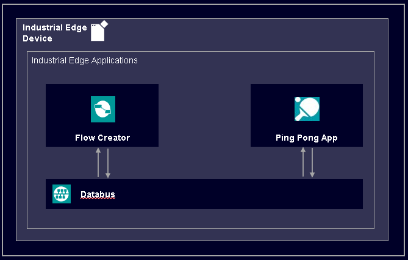
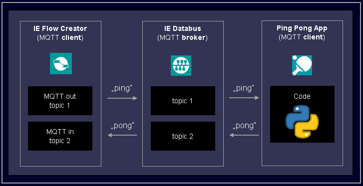

# Ping Pong Edge application implemented in Python

Application example how to communicate over MQTT broker (called Databus in case of Industrial Edge) using IE Flow Creator and Python.

There are also implementations in other programming languages, you can find them in their own repositories:

Javascript : https://github.com/industrial-edge/pingpong-nodejs

C : https://github.com/industrial-edge/pingpong-c

---

- [Ping Pong Edge application implemented in Python](#ping-pong-edge-application-implemented-in-python)
  - [QuickStart](#quickstart)
  - [Description](#description)
    - [Overview](#overview)
  - [Requirements](#requirements)
    - [Used components](#used-components)
    - [Further requirements](#further-requirements)
  - [Installation](#installation)
    - [Direct Import steps](#direct-import-steps)
    - [Complete Installation](#complete-installation)
  - [Usage](#usage)
    - [Dependencies](#dependencies)
    - [Playing ping pong](#playing-ping-pong)
  - [Documentation](#documentation)
  - [Contribution](#contribution)
  - [Licence and Legal Information](#licence-and-legal-information)

## QuickStart

If you want to run everything locally with single command just run `docker-compose up -d` and open webpage on [localhost:1880](http://localhost:1880) and import [flows](SFC-flows/Pingpong-testing.json).

## Description

This application example demonstrates how Industrial Edge application can communicate with Databus using MQTT protocol. The goal is to send a string "Ping" message to Databus (MQTT broker) to a topic "topic1" and subscribe to MQTT topic "topic2" which should return "Pong python". The return message is generated by this python application. You can play virtual ping pong using this application!

### Overview

Ready to use application example can be downloaded on [Industrial Edge GitHub repository](https://github.com/industrial-edge/ping-pong-python) in the [releases section](https://github.com/industrial-edge/ping-pong-python/releases) called PingPongApplicationExample_x.x.x.app.zip. After unzipping this file you can directly import the .app file to your Industrial Edge Management system.

The release section also includes a docker base image that was used for this application example. The base image is included here for legal reasons.

A picture bellow shows the application data flow and architecture from the docker container point of view.

## Requirements

### Used components

This application version 1.1.x was created and tested using these components

- Industrial Edge App Publisher V1.1.5
- Docker Engine 20.10.2
- Docker Compose V2.4
- Industrial Edge Device V1.1.0-39
- IE Databus Configurator V1.1.44
- IE Databus V1.1.23
- IE Flow Creator V1.0.4
- IE Management System V1.1.0-48

### Further requirements

- IE Device is onboarded to a IE Management
- IE Databus Configurator is deployed to the IE Management
- IE Databus is deployed to the IE Device
- IE Flow Creator is deployed to the IE Device

## Installation

You have two options how to install this app into Industrial Edge Management system. You can either use the [Direct Import section](#direct-import) to reuse .app we build for you or you can follow the [Complete Installation](#complete-installation) section to create the .app yourself.

### Direct Import steps

1. Import .app application available at [GitHub](https://github.com/industrial-edge/ping-pong-python/releases) to your Industrial Edge Management using one of the two options
   1. Industrial Edge App Publisher (recommended)
   2. Catalog import functionality
2. Install the imported app to onboarded Industrial Edge Device
3. Follow the configuration steps in [Installation guide](docs/Installation.md).

### Complete Installation

Comprehensive instructions for building and installing this application is available in the [Installation guide](docs/Installation.md).

## Usage

### Dependencies

In order for this application to run properly on Industrial Edge Device (IED), the following two applications must be installed and configured on the IED

- Databus application
- IE Flow Creator application

For detailed explanation have a look in the [Installation guide](docs/Installation.md) in the Testing section.

### Playing ping pong

Have a look in the [Installation guide testing section](docs/Installation.md) on how to play ping pong in Industrial Edge. :D

## Documentation
  
- Here is a link to the [docs](docs/) of this application example where you can find more information.
- You can find further documentation and help in the following links
  - [Industrial Edge Hub](https://iehub.eu1.edge.siemens.cloud/#/documentation)
  - [Industrial Edge Forum](https://www.siemens.com/industrial-edge-forum)
  - [Industrial Edge landing page](https://new.siemens.com/global/en/products/automation/topic-areas/industrial-edge/simatic-edge.html)
  - [Industrial Edge GitHub page](https://github.com/industrial-edge)
  
## Contribution

Thanks for your interest in contributing. Anybody is free to report bugs, unclear documentation, and other problems regarding this repository in the Issues section or, even better, is free to propose any changes to this repository using Merge Requests.

## Licence and Legal Information

Please read the [Legal information](LICENSE.md) and [Readme_OSS.html](ReadMe_OSS.html).
