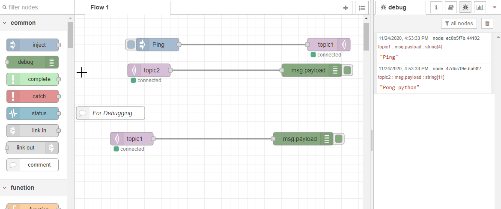

# Ping Pong Edge application implemented in Python

Application example how to communicate over MQTT broker (called Databus in case of Industrial Edge) using IE Flow Creator ([NodeRED fork](https://nodered.org/)) and Python.

- [Ping Pong Edge application implemented in Python](#ping-pong-edge-application-implemented-in-python)
  - [Description](#description)
    - [Overview](#overview)
  - [Requirements](#requirements)
    - [Used components](#used-components)
  - [Installation](#installation)
    - [Direct Import steps](#direct-import-steps)
    - [Manual Build](#manual-build)
  - [Usage](#usage)
    - [Dependencies](#dependencies)
    - [Playing ping pong](#playing-ping-pong)
  - [Documentation](#documentation)
  - [Contribution](#contribution)
  - [Licence and Legal Information](#licence-and-legal-information)

## Description

This application example demonstrates how Industrial Edge application can communicate with Databus using MQTT protocol. The goal is to send a string "Ping" message to Databus (MQTT broker) to a topic "topic1" and subscribe to MQTT topic "topic2" which should return "Pong python". The return message is generated by this python application. You can play virtual ping pong using this application!

### Overview

Ready to use application example can be downloaded on [Industrial Edge GitHub repository](https://github.com/industrial-edge/ping-pong-python) in the [releases section](https://github.com/industrial-edge/ping-pong-python/releases) called PingPongApplicationExample_x.x.x.app.zip. After unzipping this file you can directly import the .app file to your Industrial Edge Management system.

The release section also includes a docker base image that was used for this application example. The base image is included here for legal reasons.

A picture bellow shows the application data flow and architecture from the docker container point of view.

## Requirements

In order for this use case to work the following apps needs to be present and configured on the Edge device

- IE Databus
- IE Flow Creator (Can be replaced by any app that can send, receive and display MQTT messages)
- IEM ready to deploy app
- One available onboarded IE Device with enough memory available
- Configured user and user rights on the Databus MQTT broker

### Used components

This application was created and tested using these components

- Industrial Edge App Publisher V1.0.8
- Docker Engine 19.03.8
- Docker Compose V2.4
- IE Databus V 1.0.11
- IE Flow Creator V 1.0.4
- Industrial Edge Management Version 1.0.11
- Industrial Edge Device V 1.0.0-34

## Installation

You have two options how to install this app into Industrial Edge Management system. You can either use the [Direct Import section](#direct-import) to use .app we build for you or you can follow the [Manual Build](#manual-build) section to build the .app yourself.

### Direct Import steps

1. Import .app application available at [GitHub](https://github.com/industrial-edge/ping-pong-python/releases) to your Industrial Edge Management using one of the two options
   1. Industrial Edge App Publisher (recommended)
   2. Catalog import functionality
2. Install the imported app to onboarded Industrial Edge Device

### Manual Build

More comprehensive instructions for building and installing this application is available in the [Installation guide](docs/Instalation.md).

## Usage

### Dependencies

In order for this application to run properly on Industrial Edge Device (IED), the following two applications must be installed and configured on the IED

- Databus application
- IE Flow Creator application

For detailed explanation have a look at the [Installation guide](docs/Instalation.md).

### Playing ping pong

1. Navigate to IED web interface home page
2. Open IE Flow Creator UI
3. Create MQTT Input node in Flow Creator
4. Configure MQTT Broker
   1. IP address is "ie_databus", port is 1883, password and user must be configured by you in advance
5. As topic write "topic2" to node
6. Deploy the flow to check whether the connection is working. You should see green "connected" indicator after deploying
7. Repeat the same process for MQTT output node
8. Use Inject node as input to MQTT output node. Input text message should be "Ping"
9. Use Debug node as output to MQTT input node
10. Click on Inject to send message to broker. In the debug window you should see response.

The end flow should look like this.

## Documentation
  
- Here is a link to the [docs](docs/) of this application example where you can find more information.
- You can find further documentation and help in the following links
  - [Industrial Edge Hub](https://iehub.eu1.edge.siemens.cloud/#/documentation)
  - [Industrial Edge Forum](https://www.siemens.com/industrial-edge-forum)
  - [Industrial Edge landing page](https://new.siemens.com/global/en/products/automation/topic-areas/industrial-edge/simatic-edge.html)
  - [Industrial Edge GitHub page](https://github.com/industrial-edge)
  
## Contribution

Thanks for your interest in contributing. Anybody is free to report bugs, unclear documentation, and other problems regarding this repository in the Issues section or, even better, is free to propose any changes to this repository using Merge Requests.

## Licence and Legal Information

Please read the [Legal information](LICENSE.md) and [Readme_OSS.html](ReadMe_OSS.html).
