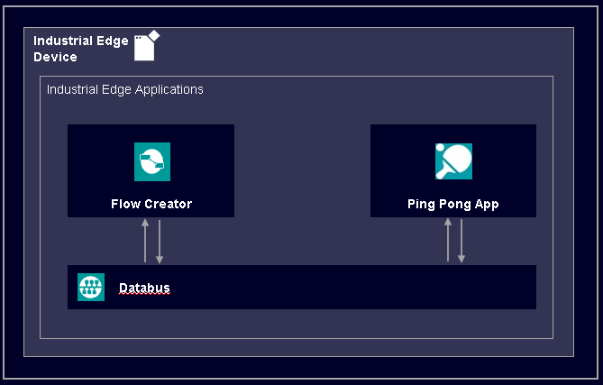
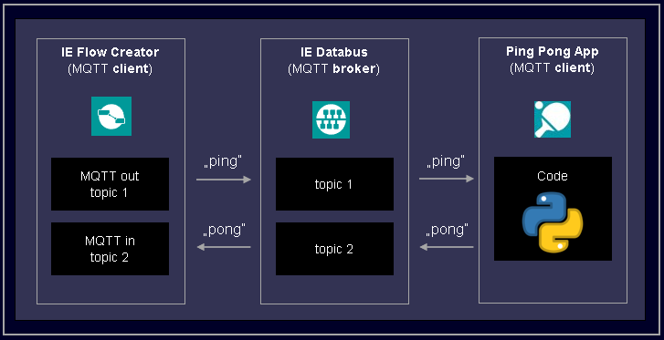
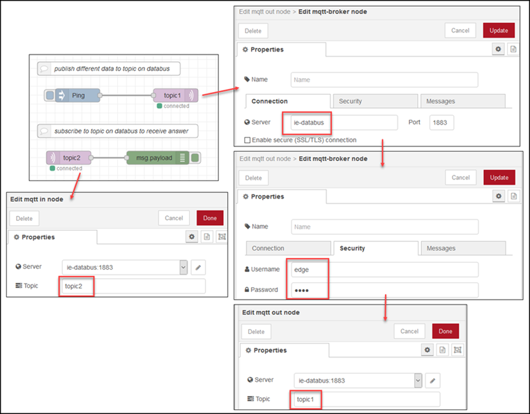

# Ping Pong Edge application implemented in Python

Application example how to communicate over MQTT broker (called Databus in case of Industrial Edge) using Flow Creator and Python.

There are also implementations in other programming languages, you can find them in their own repositories:

Javascript : https://github.com/industrial-edge/pingpong-nodejs

C : https://github.com/industrial-edge/pingpong-c

---

- [Ping Pong Edge application implemented in Python](#ping-pong-edge-application-implemented-in-python)
  - [QuickStart](#quickstart)
  - [Description](#description)
    - [Overview](#overview)
  - [Requirements](#requirements)
    - [Used components](#used-components)
    - [Further requirements](#further-requirements)
  - [Installation](#installation)
    - [Direct Import steps](#direct-import-steps)
    - [Complete Installation](#complete-installation)
  - [Usage](#usage)
    - [Dependencies](#dependencies)
    - [Playing ping pong](#playing-ping-pong)
  - [Documentation](#documentation)
  - [Contribution](#contribution)
  - [License and Legal Information](#license-and-legal-information)
  - [Disclaimer](#disclaimer)

## QuickStart

If you want to run everything locally with single command just run `docker-compose up -d` and open webpage on [localhost:1880](http://localhost:1880) and import [flows](SFC-flows/Pingpong-testing.json).

## Description

This application example demonstrates how Industrial Edge application can communicate with Databus using MQTT protocol. The goal is to send a string "Ping" message to Databus (MQTT broker) to a topic "topic1" and subscribe to MQTT topic "topic2" which should return "Pong python". The return message is generated by this python application. You can play virtual ping pong using this application!

### Overview

Ready to use application example can be downloaded on [Industrial Edge GitHub repository](https://github.com/industrial-edge/ping-pong-python) in the [releases section](https://github.com/industrial-edge/ping-pong-python/releases) called PingPongApplicationExample_x.x.x.app.zip. After unzipping this file you can directly import the .app file to your Industrial Edge Management system.

The release section also includes a docker base image that was used for this application example. The base image is included here for legal reasons.

A picture bellow shows the application data flow and architecture from the docker container point of view.

## Requirements

###  Prerequisites

- Access to an Industrial Edge Management (IEM) with onboarded Industrial Edge Device (IED)
- IEM: Installed apps: Databus Configurator
- IED: Installed apps: Databus, Flow Creator

### Used components

- Industrial Edge Management (IEM) V2.6.1-4 / V1.15.9
  - Databus Configurator V3.2.3
- Industrial Edge Virtual Device (IED) V1.24.1-1b
  - Databus V3.2.3
  - Flow Creator V 1.19.2
- Industrial Edge App Publisher V1.23.5
- Docker Engine V29.0.1
- Docker Compose V2.4
- Web browser (Chrome)

## Installation

Please refer to the [Installation](https://github.com/industrial-edge/pingpong-csharp/blob/main/docs/Installation.md#installation) section of the *Ping Pong in C#* repository on how to build and deploy the application to an IED. Just use the source files from this repository and follow the instructions.

- [Build application](https://github.com/industrial-edge/pingpong-csharp/blob/main/docs/Installation.md#build-application)
- [Configuring the Industrial Edge Databus](https://github.com/industrial-edge/pingpong-csharp/blob/main/docs/Installation.md#configuring-the-industrial-edge-databus)
- [Create configuration for the application](https://github.com/industrial-edge/pingpong-csharp/blob/main/docs/Installation.md#create-configuration-for-the-application)
- [Upload the application to the Industrial Edge Management](https://github.com/industrial-edge/pingpong-csharp/blob/main/docs/Installation.md#upload-the-application-to-the-industrial-edge-management)
- [Configuring and deploying the application to a Industrial Edge Device](https://github.com/industrial-edge/pingpong-csharp/blob/main/docs/Installation.md#configuring-and-deploying-the-application-to-a-industrial-edge-device)

### Direct Import steps

1. Import .app application available at [GitHub](https://github.com/industrial-edge/ping-pong-python/releases) to your Industrial Edge Management using one of the two options
   1. Industrial Edge App Publisher (recommended)
   2. Catalog import functionality
2. Install the imported app to onboarded Industrial Edge Device
3. Follow the configuration steps in [Installation guide](docs/Installation.md).

### Complete Installation

Comprehensive instructions for building and installing this application is available in the [Installation guide](docs/Installation.md).

## Usage

Once the application is successfully deployed to the IED, it can be tested using the Flow Creator.

On the IED restart the PingPong application, to ensure the right configuration is used. Then open the app Flow Creator and set it up as following:

- Connect an "inject" node with a "mqtt out" node
- Connect a "mqtt in" node with a "debug" node
- Configure the mqtt-nodes to connect to the databus (mqtt broker, username, password)
- Set the topics of the mqtt-nodes according to the configuration of the application (here: "topic1" to publish to, "topic2" to subscribe to)

Deploy the flow and test by injecting a string payload into the mqtt in node. If the string is "Ping", the application will answer with "Pong". If the string is "Pong" the application will answer with "Ping".

The finished flow is available [here](SFC-flows/Pingpong-testing.json) and can be imported into the Flow Creator.

## Documentation
 
- You can find further documentation and help in the following links
  - [Industrial Edge Hub](https://iehub.eu1.edge.siemens.cloud/#/documentation)
  - [Industrial Edge Forum](https://forum.mendix.com/link/space/industrial-edge)
  - [Industrial Edge landing page](https://new.siemens.com/global/en/products/automation/topic-areas/industrial-edge/simatic-edge.html)
  - [Industrial Edge GitHub page](https://github.com/industrial-edge)
  - [Industrial Edge documentation page](https://docs.industrial-operations-x.siemens.cloud/p/industrial-edge)
  
## Contribution

Thank you for your interest in contributing. Anybody is free to report bugs, unclear documentation, and other problems regarding this repository in the Issues section.
Additionally everybody is free to propose any changes to this repository using Pull Requests.

If you haven't previously signed the [Siemens Contributor License Agreement](https://cla-assistant.io/industrial-edge/) (CLA), the system will automatically prompt you to do so when you submit your Pull Request. This can be conveniently done through the CLA Assistant's online platform. Once the CLA is signed, your Pull Request will automatically be cleared and made ready for merging if all other test stages succeed.

## License and Legal Information

Please read the [Legal information](LICENSE.txt).

## Disclaimer

IMPORTANT - PLEASE READ CAREFULLY:

This documentation describes how you can download and set up containers which consist of or contain third-party software. By following this documentation you agree that using such third-party software is done at your own discretion and risk. No advice or information, whether oral or written, obtained by you from us or from this documentation shall create any warranty for the third-party software. Additionally, by following these descriptions or using the contents of this documentation, you agree that you are responsible for complying with all third party licenses applicable to such third-party software. All product names, logos, and brands are property of their respective owners. All third-party company, product and service names used in this documentation are for identification purposes only. Use of these names, logos, and brands does not imply endorsement.

