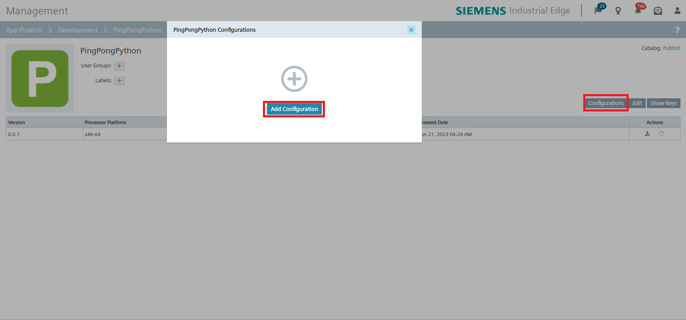
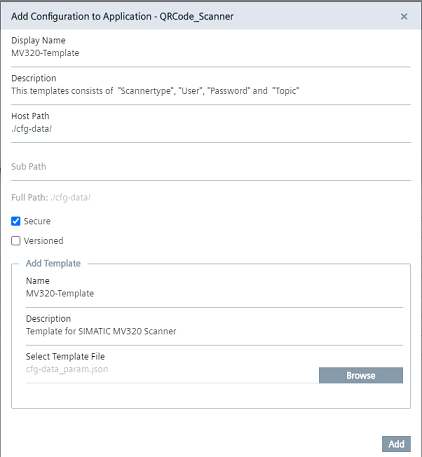
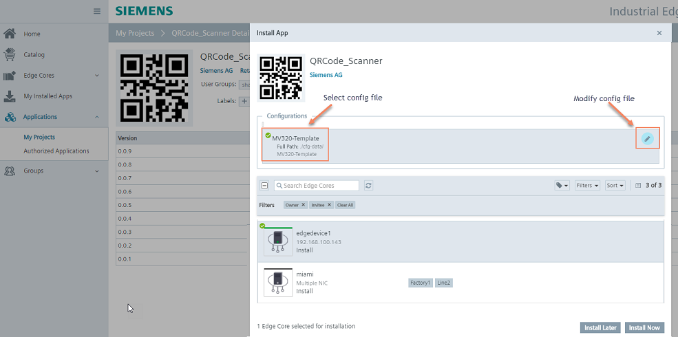

# Installation

- [Installation](#installation)
  - [Build application](#build-application)
    - [Cloning image](#cloning-image)
    - [Build docker image](#build-docker-image)
  - [Upload Scanner App to the Industrial Edge Management](#upload-scanner-app-to-the-industrial-edge-management)
    - [Connect your Industrial Edge App Publisher](#connect-your-industrial-edge-app-publisher)
    - [Upload Scanner App suing the Industrial Edge App Publisher](#upload-scanner-app-suing-the-industrial-edge-app-publisher)
  - [Deploying of QR Code Scanner Demo](#deploying-of-qr-code-scanner-demo)
    - [Configuring application](#configuring-application)
    - [Create & Deploy configuration file](#create--deploy-configuration-file)
      - [Create configuration](#create-configuration)
      - [Deploy application with configuration file](#deploy-application-with-configuration-file)

## Build application

### Cloning image

- Clone or Download the source code to your engineering VM

### Build docker image

- Open console in the source code folder
- Use command `docker-compose build` to create the docker image.
- This docker image can now be used to build you app with the Industrial Edge App Publisher
- *docker images* can be used to check for the images

## Upload Scanner App to the Industrial Edge Management

Please find below a short description how to publish your application in your IEM.

For more detailed information please see the section for [uploading apps to the IEM](https://code.siemens.com/industrial-edge-sup/how-to-s/app-uploading-to-iem).

### Connect your Industrial Edge App Publisher

- Connect your Industrial Edge App Publisher to your docker engine
- Connect your Industrial Edge App Publisher to your Industrial Edge Managment System

### Upload Scanner App suing the Industrial Edge App Publisher

- Create a new application using the Industrial Publisher
- Add a app new version
- Import the [docker-compose](../docker-compose.yml) file using the **Import YAML** button
- The warning `Build (sevices >> pingpong-python) is not supported` can be ignored
- **Start Upload** to transfer the app to Industrial Edge Managment
- Further information about using the Industrial Edge App Publisher can be found in the [IE Hub](https://iehub.eu1.edge.siemens.cloud/documents/appPublisher/en/start.html)

## Deploying of QR Code Scanner Demo

### Configuring application

You can find the configuration file "param.json" in cfg-data folder. This configuration file can be used adjust several parameters of this application. You can see the structure of the file in the following example configuration:

[mqtt-config.json](../cfg-data/mqtt-config.json)

```json
{
    "MQTT_USER":"edge",
    "MQTT_PASSWORD":"edge",
    "MQTT_IP":"ie_databus",
    "TOPIC_1":"topic1",
    "TOPIC_2":"topic2"
}
```

Adjust the configuration file depending on your needs.

### Create & Deploy configuration file

#### Create configuration

Once you have successfully uploaded the QR Code Scanner application to your IEM you need to add the mentioned configuration file to your application. You can either choose between version and non versioned configuration files. The non version configuration file will be described in the next steps.
Go to **Applications/** **My Projects** and open your application. Here you can create a new configuration file. Screenshots are from different app but procedure is the same.

**Add** **Configuration**


**Configure** **Configuration**



#### Deploy application with configuration file

During the deploying process of the application you need to select the configuration file, if needed you can adapt the configuration file before deploying.

**Deploy** **Application**


