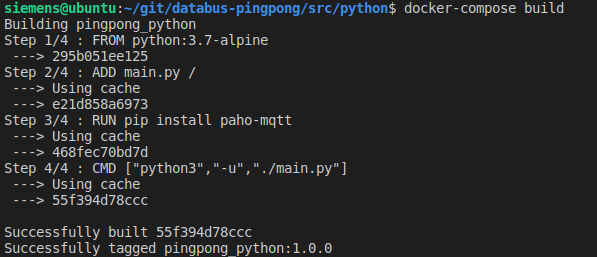
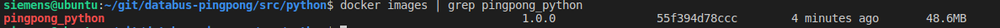
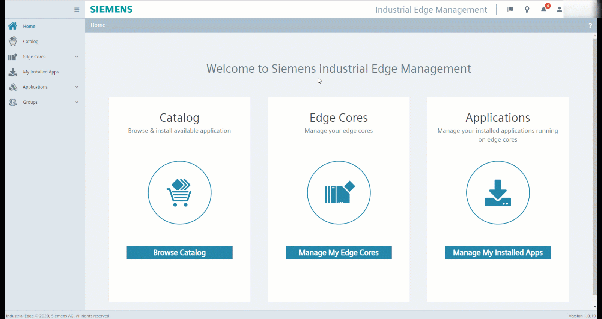
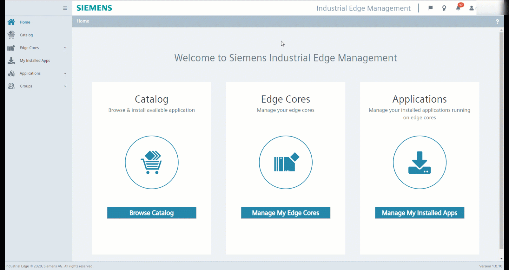

# Installation of the PingPong application

- [Installation of the PingPong application](#installation-of-the-pingpong-application)
- [Build application](#build-application)
  - [Cloning the repository](#cloning-the-repository)
  - [Build docker image](#build-docker-image)
- [Upload the app to the Industrial Edge Management](#upload-the-app-to-the-industrial-edge-management)
- [Configuring and deploying the app to a Industrial Edge Device](#configuring-and-deploying-the-app-to-a-industrial-edge-device)
  - [Creating a configuration for the application](#creating-a-configuration-for-the-application)
  - [Configuring the Industrial Edge Databus](#configuring-the-industrial-edge-databus)
  - [Installing the application to a Industrial Edge Device](#installing-the-application-to-a-industrial-edge-device)
- [Testing the application using Simatic Flow Creator](#testing-the-application-using-simatic-flow-creator)

# Build application

## Cloning the repository

- Clone or Download the source code to your engineering VM

## Build docker image

- Open a console in the root directory of this repo
- Use command `docker-compose build` to build the docker image.
- This docker image can now be used to build you app with the Industrial Edge App Publisher



- After building, use `docker images | grep <image_name>` to check if the image was build correctly. For example, the name of the python image is `pingpong_python`

You should see a similar result to this:



# Upload the app to the Industrial Edge Management

Please refer to [Uploading App to IEM](https://github.com/industrial-edge/upload-app-to-industrial-edge-management) on how to upload the app to the IEM. For importing the configuration in the IE publisher use the [docker-compose.prod.yml](../docker-compose.prod.yml) file please.

# Configuring and deploying the app to a Industrial Edge Device

Before deploying to a Industrial Edge Device, a configuration for the application has to be created ans the Industrial Edge Databus has to be configured.

## Creating a configuration for the application

To configure the databus topics, username and password of the pingpong application, a new configuration for the application has to be created in the Industrial Edge Management. The following parameters are required by the application:

- "MQTT_USER": username of user in databus, must exist
- "MQTT_PASSWORD": password of user in databus
- "TOPIC_1": databus topic to which the app subscribes to
- "TOPIC_2": databus topic to which the app publishes to

The configuration file has to be named `mqtt-config.json` and has to be structured like the following example configuration:

```json
{
    "MQTT_USER":"edge",
    "MQTT_PASSWORD":"edge",
    "TOPIC_1":"topic1",
    "TOPIC_2":"topic1"
}
```

In the example above, the app will authenticate to the IE databus with the username `edge` and password `edge`. It will subscribe to `topic1` and will publish to `topic2`.

If no configuration is provided (e.g if the app is deployed as a standalone application), the application will use the corresponding environmental variables specified in the `docker-compose.yml` file.

To create a configuration for the application follow these steps:

- Open the "Applications" -> "My Projects" Tab in the Industrial Edge Management web interface
- Click on your PingPong application
- Click on "Configurations" and "Add Configuration"
- Enter a Name and Description. Enter `./cfg-data` as host path. Check the "versioned" Checkbox and click "Add"
- Click on the "+" Button to add a new version of the configuration
- Enter a Name and Description. Browse for the `mqtt-config.json` file in the `cfg-data` folder of this repository.
- Click on the pencil button next to the version to verify that all parameters are set correctly.


## Configuring the Industrial Edge Databus

To be able to authenticate with the databus to publish and subscribe to the configured topics, the Industrial Edge Databus has to be configured appropriately.

- In the Industrial Edge Management Web interface, click on "My Installed Apps" and select the Databus
- Click on "Update Configuration", select the corresponding Industrial Edge Device and click "Launch Configurator"
- Create a new user with the username and password defined for the pingpong application
- Create the topics needed by the pingpong application and give the user publish and subscribe permission
- Deploy the databus configuration and wait for the job to be finished successfully



## Installing the application to a Industrial Edge Device

As soon as a configuration for the application is created and the Industrial Edge Databus is configured, the app can be installed to an Industrial Edge Device.

Industrial Edge Management Web interface:

- Click on the application under the "Applications"->"My Projects" Tab
- Click on the install button of the version you want to deploy
- Select the application configuration and the version of the configuration
- Select the corresponding Industrial Edge Device
- Click "Install Now" and wait for the job to be finished successfully



When the pingpong application is deployed and running on the Industrial Edge Device, it can be tested using the Simatic Flow Creator.

# Testing the application using Simatic Flow Creator

- Open the web interface of the Simatic Flow Creator
- Connect a "inject" node with a "mqtt out" node
- Connect a "mqtt in" node with a "debug" node
- Configure the mqtt-nodes to connect to the databus. Enter the hostname, username and password
- Set the topics of the mqtt-nodes according to the configuration of the application. For example `topic1` as the topic to publish to and `topic2` as the topic to subscribe to.
- Deploy the flow and test by injecting a string payload into the mqtt in node. If the string is "Ping", the app will answer with "Pong". If the string is "Pong" the app will answer with "Ping".

The finished flow is available [here](./src/SFC-flows/Pingpong-testing.json) and can be imported into the simatic flow creator.


